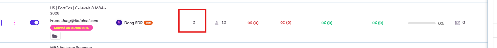
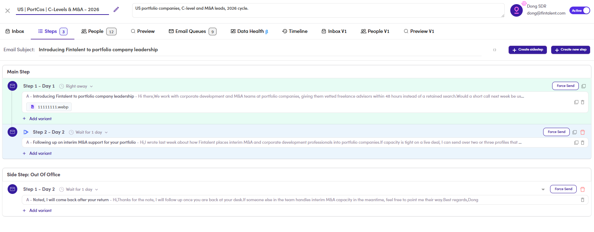

# CMP-16 · Total Steps

> 6‡ · Manage a campaign, issues → 6‡.0 · The register

**What happens.** *US | PortCos | C-Levels & M&A – 2026* shows **Total Steps 2** on the campaign list. Open it and the **Steps** badge reads **3**: two main steps and one sidestep, *Out Of Office*.

**What should happen.** One definition, printed the same way in both places. Either both count the sidestep or neither does.

**Why it matters.** Small on its own, but **Total Steps** is one of the numbers used to judge whether a campaign is finished, and a sidestep is not an ordinary step: it fires on a condition, not in sequence. Counting it silently in one place and not the other means neither number can be trusted without opening the campaign.

*CMP-16: the list row, 2.*

*CMP-16: the same campaign, Steps 3, made of two main steps plus Side Step: Out Of Office.*

Guide: [6.2 ↗](6-2-build-the-sequence.md) and [6.3 ↗](6-3-view-campaigns.md).
