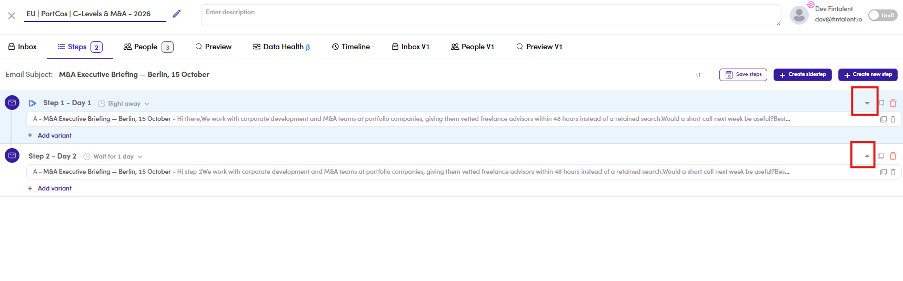
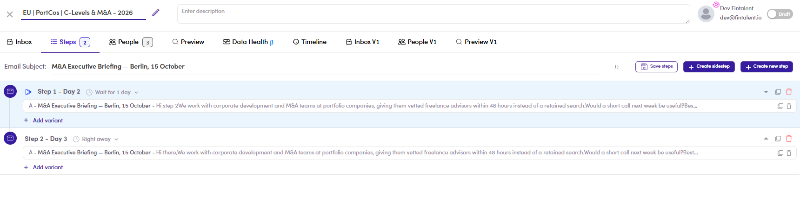

# CMP-17 · Reordering steps

> 6‡ · Manage a campaign, issues → 6‡.0 · The register

**What happens.** Before: **Step 1 – Day 1, Right away** and **Step 2 – Day 2, Wait for 1 day**. Move them with the arrows and it reads **Step 1 – Day 2, Wait for 1 day** and **Step 2 – Day 3, Right away**.

**What should happen.** The bodies swap; the schedule stays with the position. Step 1 is always **Right away**, because there is nothing for it to wait behind.

**Why it matters.** Two wrong things at once. **The first email of the campaign now waits a day** before anything is sent, and step 2 says **Right away** while being labelled **Day 3**, so the label and the setting contradict each other on the same row. Neither is announced, and the reorder arrows are exactly the control someone uses while tidying up a sequence they thought was finished.

*CMP-17, before: Day 1 Right away, then Day 2 Wait for 1 day.*

*CMP-17, after: Day 2 Wait for 1 day in first position, Day 3 Right away in second.*

Guide: [6.2 ↗](6-2-build-the-sequence.md).
