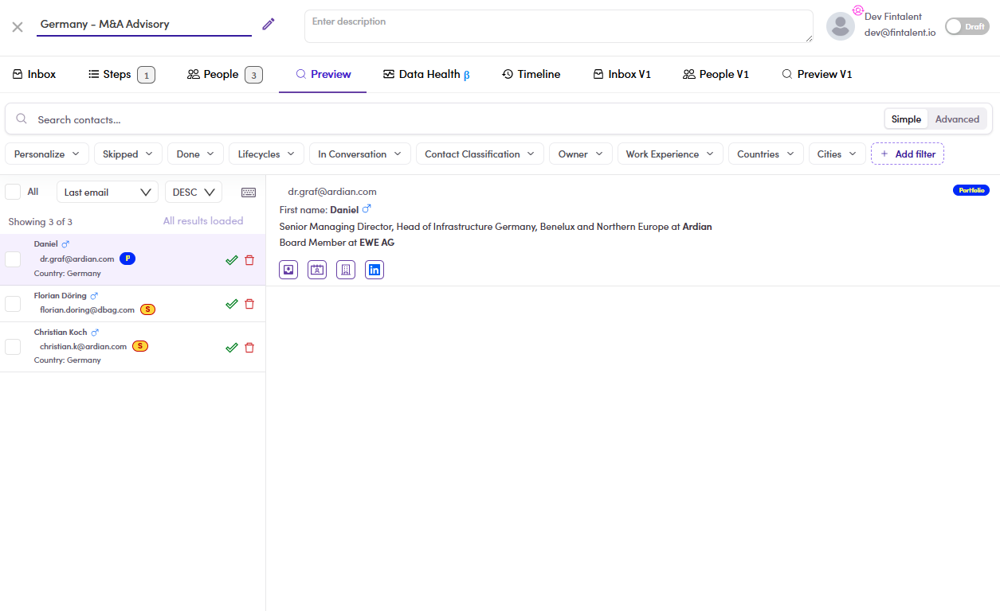

# CMP-18 · Admin campaign Preview

> 6‡ · Manage a campaign, issues → 6‡.0 · The register

**What happens.** *Germany – M&A Advisory*, created with the **dev@fintalent.io** admin account, badge reading **Steps 1**. On the **Preview** tab the contact list and the contact card are there, and **the step block is absent**: no subject, no body, nothing to read. A campaign created by the SDR shows its step normally.

**What should happen.** Preview shows the step whoever created the campaign.

**Why it matters.** Preview is the review gate for the whole flow. Personalize, **Skip**, **Mark done** and the blocked-contact check all live on the step block, so with the block missing there is nothing to review and nothing to mark. Everything after it in [6.5 ↗](6-5-preview-and-review.md) is unreachable, and the hand-over in [6.6 ↗](6-6-hand-it-over-to-be-run.md) asks for a done count that cannot be produced. Worth knowing that ownership decides this, since the obvious reading is that the campaign has no content.

*CMP-18: Steps 1 on the badge, contact card present, no step underneath it.*

Guide: [6.5 ↗](6-5-preview-and-review.md).
