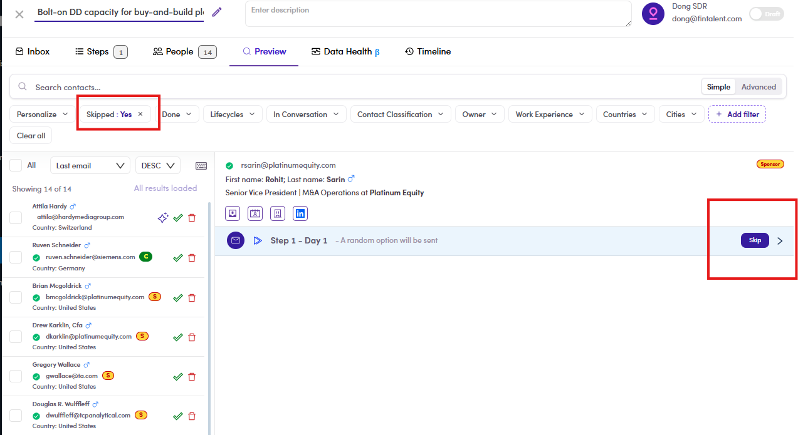

# CMP-19 · Skipped filter

> 6‡ · Manage a campaign, issues → 6‡.0 · The register

**What happens.** **Skipped : Yes** on the Preview tab, and the list still reads **Showing 14 of 14**. The contact opened next to it still offers a **Skip** button on its step, so it was never skipped in the first place.

**What should happen.** The list narrows to the contacts that carry a skip.

**Why it matters.** Skipping is per contact and per step, and the filter is the only way to see who you have skipped. Without it there is no way to answer *who is not getting step 1* before the campaign runs, which is the check that belongs immediately before hand-over.

*CMP-19: chip reads Skipped : Yes, list reads 14 of 14, and the step still offers Skip.*

Guide: [6.5.3 ↗](6-5-3-skip-a-step.md).
