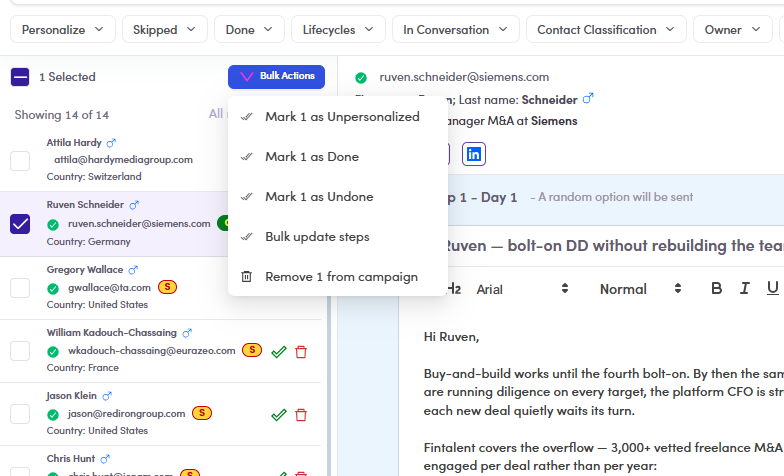

# CMP-20 · Bulk update steps

> 6‡ · Manage a campaign, issues → 6‡.0 · The register

**What happens.** Tick a contact, open **Bulk Actions**, choose **Bulk update steps**. Nothing happens: no dialog, no toast, no change on the rows.

**What should happen.** Either it does the thing, or it is not offered. The neighbouring items in the same menu, **Mark as Done**, **Mark as Undone**, **Mark as Unpersonalized** and **Remove from campaign**, all work.

**Why it matters.** A dead item in a working menu is worse than a missing one. It sits in the list of things that operate on a selection, so a reader assumes it ran and moves on.

*CMP-20: Bulk update steps, third in a menu whose other four items all do something.*

Guide: [6.5.5 ↗](6-5-5-mark-done.md).
