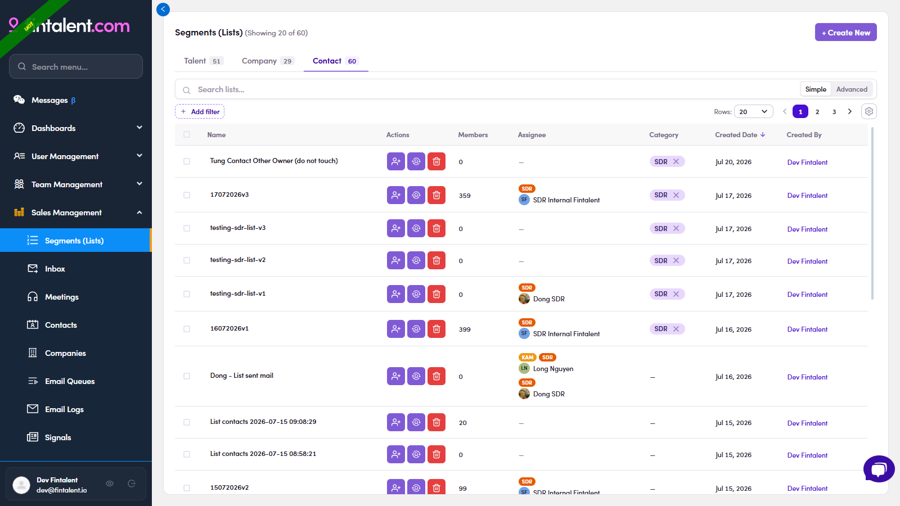

# O1.1 · Your Ops menu

> O1 · Your Ops workspace

## O1.1

Under **Sales Management** an Ops/Admin sees more than an SDR: besides Segments · Inbox · Meetings, you also get **Contacts** and **Companies** (the data tables), plus Email Queues · Email Logs · Signals. Head to **Segments (Lists)** — the page has tabs **Talent · Company · Contact**, per-row **Actions** (👤+ add members · assign · 🗑 delete), an **Assignee** column and a **Category** column (the SDR label).

*O1.2 — Segments (Lists) as Ops: full menu on the left (incl. Contacts/Companies), tabs, Actions · Assignee · Category columns, + Create New.*
