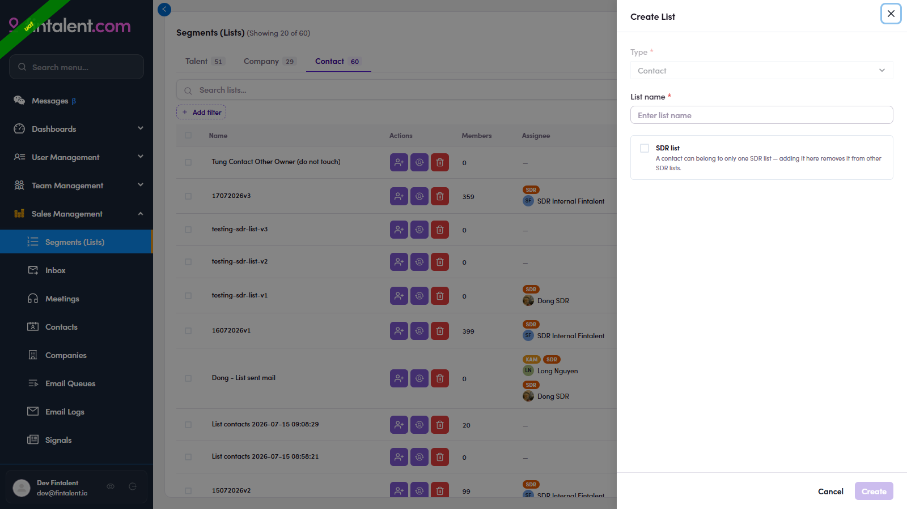

# O2.3 · Create the list

> O2 · Create a list

1. **O2.3** — **+ Create New** (top right) → the **Create List** drawer: **Type** (Contact, pre-set) · **List name*** · optional **SDR list** checkbox (see edge case) → **Create**. The empty list now appears on the Segments page, ready to fill (O3).

   

   *O2.3 — Create List: Type · List name · SDR list checkbox (with the exclusivity rule).*
