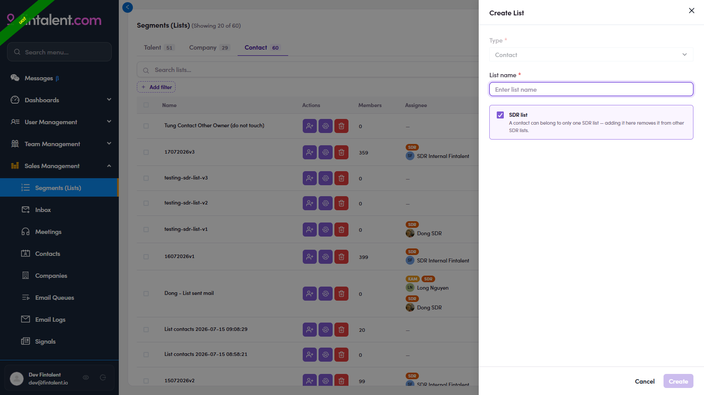

# O2.x.1 · "SDR list" exclusivity

> O2 · Create a list → O2.x · Edge cases

**"SDR list", one contact, one SDR list.** In the Create List drawer, **tick the SDR list checkbox** (circled below) to make it an exclusive rep list. The rule: **a contact can belong to only one SDR list**, if they're already in one, adding them to a second SDR list is **skipped** (they stay in the first, and a toast tells you. See O3.x.6). This is what guarantees a rep's contacts aren't also being worked by another rep. Non-SDR lists have no such limit.

*O2.x.1: the SDR list checkbox ticked (card highlighted) + its exclusivity rule.*

> **In-app copy mismatch: real behavior is skip-and-keep-first**
>
> The Create-List checkbox helper currently reads the **opposite** ("A contact can belong to only one SDR list, adding it here **removes it from other SDR lists**", i.e. move). The real behavior is **skip-and-keep-first**: a contact **stays** in its first SDR list and the second add is **skipped** (see O3.x.6). That in-app helper copy should be corrected.
