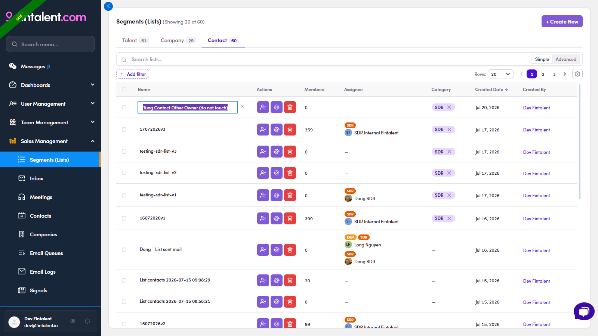

# O2.x.2 · Edit the name

> O2 · Create a list → O2.x · Edge cases

**Edit the name.** You don't re-create a list to rename it. **Step by step:** ① open **Segments (Lists)** → the **Contact** tab → find the list's row. ② **Click the list name** → it turns into an inline text field. ③ Type the new name → confirm with **✓** (or **✕** to cancel). The row updates in place.

*O2.x.2: click the list name to rename it inline (✓ save · ✕ cancel).*
