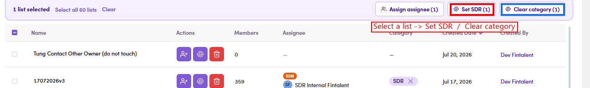

# O2.x.3 · Edit the category

> O2 · Create a list → O2.x · Edge cases

**Edit the category (the SDR label).** The category is what makes a list an exclusive **SDR list** (one contact → one SDR list, see O2.x.1). **Step by step:** ① open **Segments (Lists)** → the **Contact** tab. ② **Tick the list's checkbox** → an action bar appears. ③ Click **Set SDR** to give it the SDR category, or **Clear category** to remove it. (A list that already has the category also shows an **✕** on its **SDR** badge in the Category column — a one-click clear.)

*O2.x.3 — select a list → the action bar's Set SDR / Clear category (the Category-column badge ✕ also clears).*
