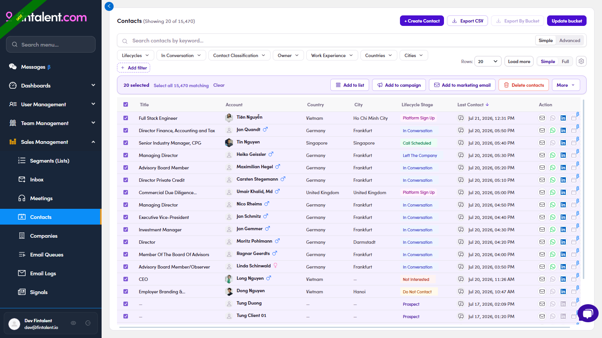

# O3.1.2 · Select contact(s)

> O3 · Add contacts to list → O3.1 · From the Contacts page

**Select the contact(s)** — tick the checkbox on each row you want. A blue action bar appears: **Add to list · Add to campaign · Add to marketing email · Delete contacts · More**.

*O3.1.2 — tick rows → the action bar with Add to list.*
