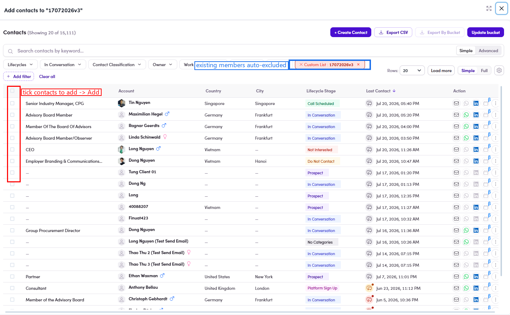

# O3.2.2 · + Add members

> O3 · Add contacts to list → O3.2 · From the list detail

**Click + Add members** → the **Add contacts to "<list>"** picker opens. Contacts **already in this list are auto-excluded** (a **Custom List** filter chip does this), so you only see people you can still add.

*O3.2.2 — the picker: the Custom List chip auto-excludes current members; tick contacts on the left.*
