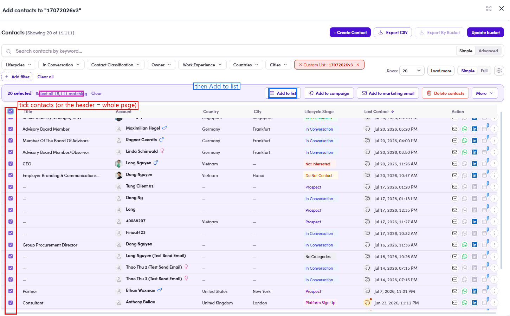

# O3.2.3 · Select contacts

> O3 · Add contacts to list → O3.2 · From the list detail

**Select the contact(s)** — tick each row, or the **header checkbox** (whole page), or **Select all N matching**. A "**N selected**" action bar appears.

*O3.2.3 — rows ticked → 20 selected · Select all matching + the action bar's Add to list.*
