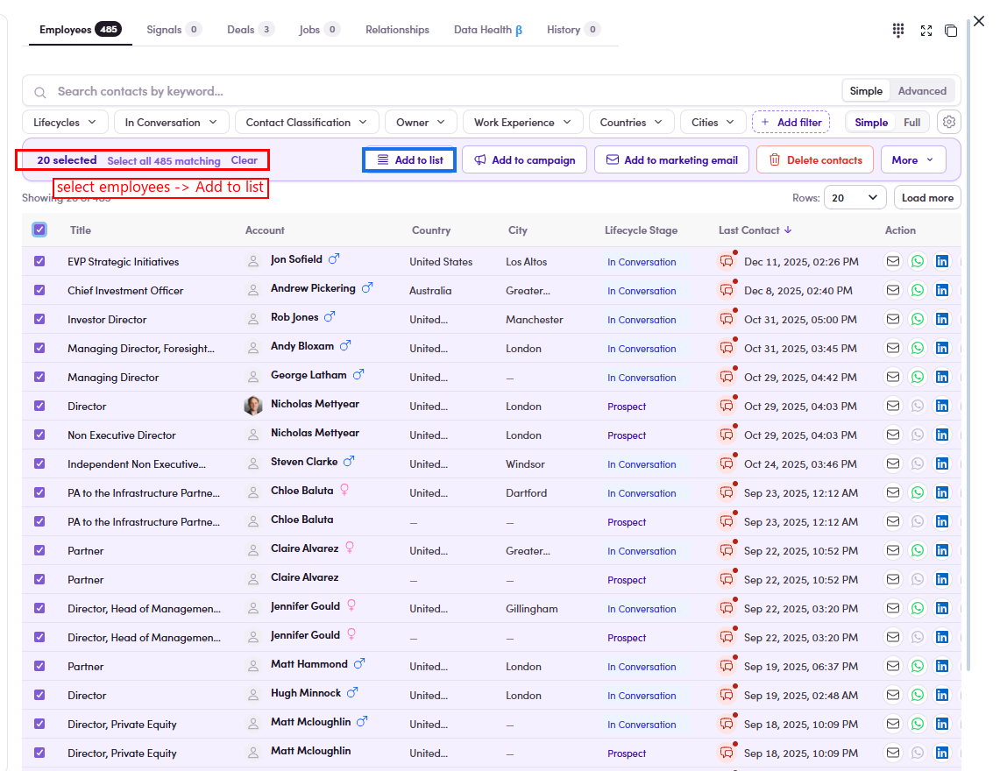

# O3.3.3 · Select employees

> O3 · Add contacts to list → O3.3 · From Employees tab

**Select the employee(s)** — tick each row, or the **header checkbox** / **Select all N matching**. A "**N selected**" action bar appears with **Add to list**.

*O3.3.3 — employees ticked → 20 selected · Select all 485 matching → Add to list.*
