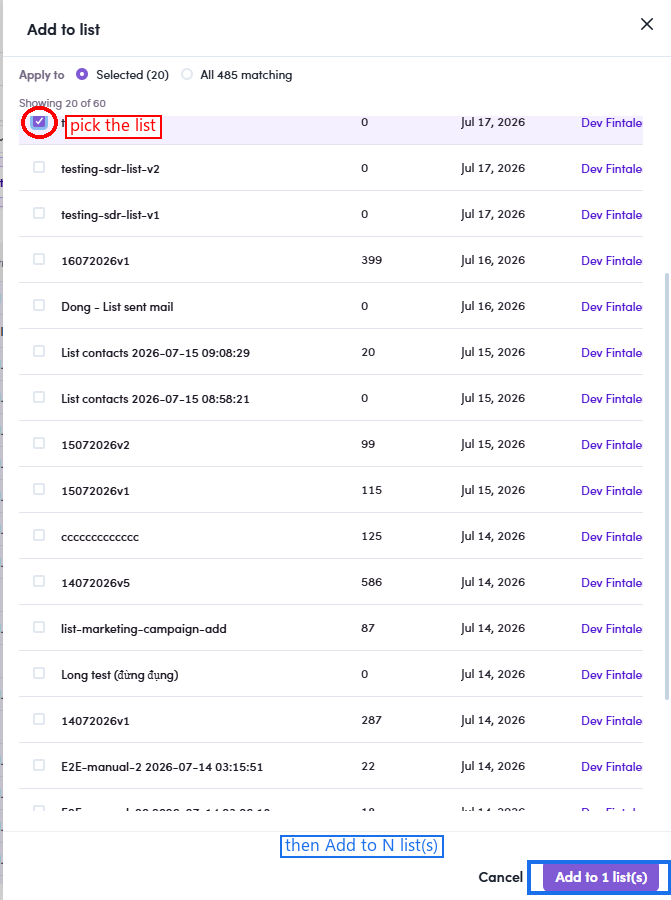

# O3.3.4 · Add to list

> O3 · Add contacts to list → O3.3 · From Employees tab

**Click Add to list** → the **list picker** opens (Apply to = Selected) → **tick the target list** → **Add to N list(s)**. Good for grabbing everyone at one firm.

*O3.3.4 — from Employees you still pick a list (testing-sdr-list-v3 ticked) → Add to 1 list(s).*
