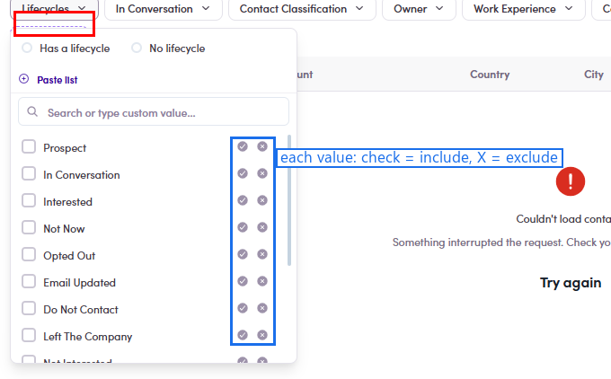

# O3.x.1 · Use a filter

> O3 · Add contacts to list → O3.x · Edge cases

**Use a filter.** Click a filter chip (e.g. **Lifecycles · Countries · Work Experience · Owner**) → the dropdown lists every value, each with a **✓ (include)** and an **✕ (exclude)** on the right → click to narrow the table. **+ Add filter** pins more. Filter first, then select (O3.1.2).

*O3.x.1 — the Lifecycles filter open: each value has ✓ include / ✕ exclude (circled).*
