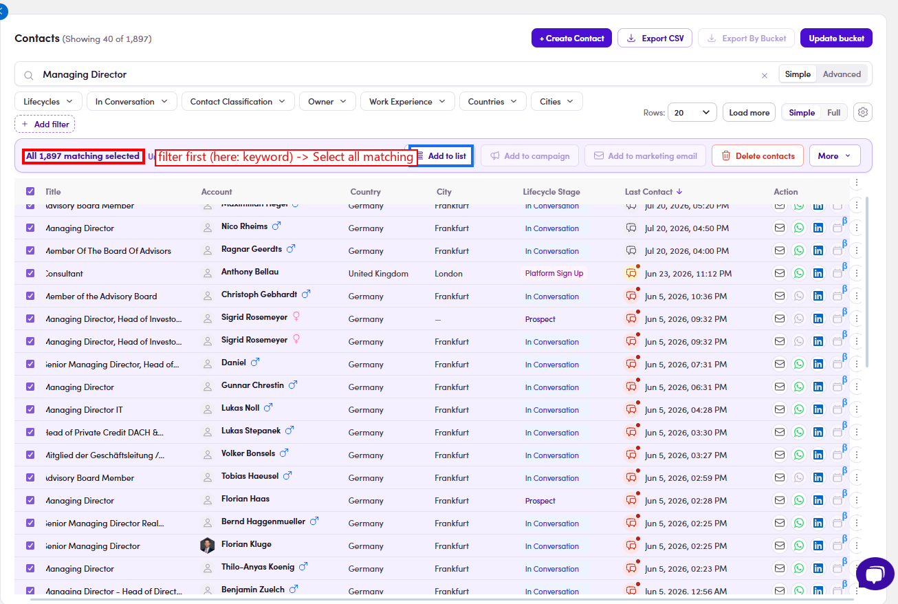

# O3.x.3 · Select all matching

> O3 · Add contacts to list → O3.x · Edge cases

**Select all N matching (bulk).** Instead of ticking one page, tick the **header checkbox** then click **"Select all N matching"** → the bar shows **All N matching selected** → **Add to list** adds the **whole filtered set**. **⚠ Note:** you must have **at least one filter or keyword active** first, without a filter, Select-all-matching won't let you Add to list (it stops you from dumping the entire database into a list by accident).

*O3.x.3: with a keyword filter active: All 1,897 matching selected → Add to list.*
