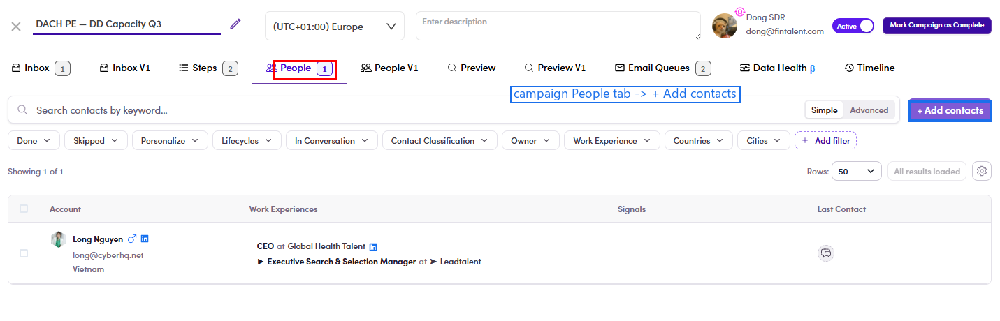

# O3.x.5 · + Add contacts (Camp/ME)

> O3 · Add contacts to list → O3.x · Edge cases

**Add via "+ Add contacts" (Campaign / Marketing Email).** Open the **Campaign** (or **Marketing Email**) → the **People** tab → click **+ Add contacts** (top right) → the contacts picker opens → filter/tick → **Add**. This loads that campaign's / ME's **audience** — the reason SDRs can't add people themselves.

*O3.x.5 — a live campaign's People tab (1 person) → + Add contacts (top-right) opens the contacts picker.*
