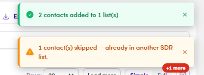

# O3.x.6 · Duplicates & SDR skip

> O3 · Add contacts to list → O3.x · Edge cases

**Duplicates & SDR-list skip: read the toast.**

- **Already in this list** → the contact is **silently skipped**; no duplicate row is created and the count doesn't double-count them.

- **Already in another SDR list** → the contact is **skipped, not added**. A contact can live in only **one SDR list** at a time (the exclusivity rule, O2.x.1), so the system **protects the existing assignment** and shows a **toast with the count skipped** (e.g. "1 contact(s) skipped, already in another SDR list"), telling you they were skipped because they're already in another SDR list. To move them, first **remove them from the old SDR list** (O4), then add.

*O3.x.6: the toast: some added, but a contact already in another SDR list is skipped (not moved), the other rep's assignment is protected.*
