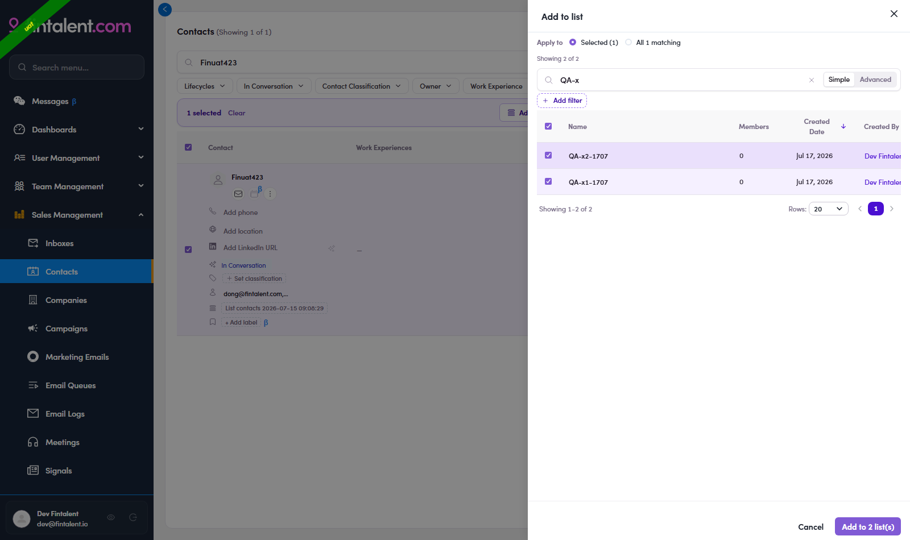

# O3.x.8 · Add to several lists

> O3 · Add contacts to list → O3.x · Edge cases

**Add to several lists at once.** The **Add to list** drawer isn't one-list-only. **Tick as many lists as you want** (use the search to find them). The confirm button counts your picks: with two lists ticked it reads **"Add to 2 list(s)"** → click it and the selected contact(s) are added to **all** those lists in one go.

*O3.x.8: two lists ticked in the drawer → the confirm button becomes "Add to 2 list(s)" → Save adds to both.*
