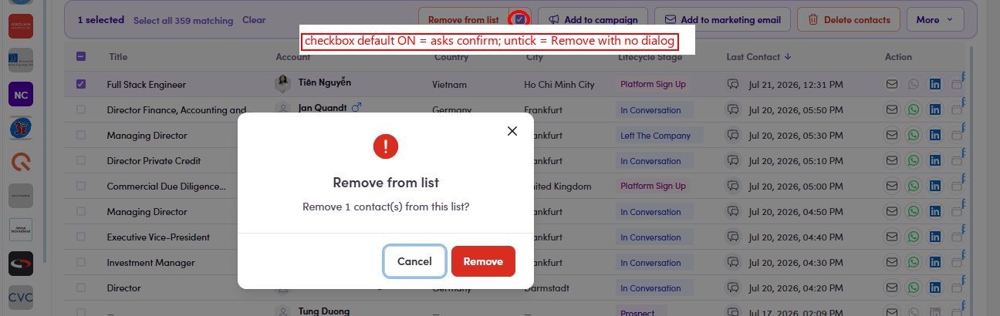

# O4.5 · Remove + confirm

> O4 · Remove members

In the action bar click **Remove from list** → confirm. Removing only breaks the **membership link**: the contact itself is untouched (they stay in Contacts and in any other list). **Verify** the drop in the **Members** column (Segments page or the list's Members tab; see O3.x.7).

*O4.5: Remove from list in the action bar → the Remove from list confirm dialog.*
