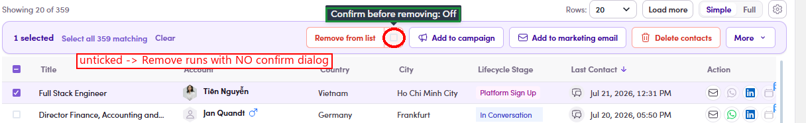

# O4.x.3 · The confirm prompt

> O4 · Remove members → O4.x · Edge cases

**Skip the confirm — untick the checkbox.** Beside **Remove from list** in the action bar sits a checkbox that is **ticked by default** — that's why every Remove pops the **Remove from list** dialog (so you can't wipe members by accident). **Untick it** and Remove runs **immediately, with no confirm dialog**, for the rest of your session; re-tick it to bring the safety prompt back.

*O4.x.3 — the checkbox unticked (tooltip: "Confirm before removing: Off") → Remove runs with no confirm dialog.*
