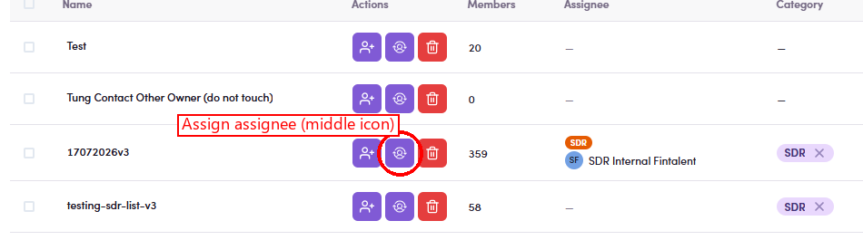

# O5.3 · Click Assign icon

> O5 · Assign a list to an SDR

In that row's **Actions** column click the **Assign assignee** icon (the gear/assign icon — the middle of the three row-action icons: add-members · assign · delete). The current owner (if any) shows in the **Assignee** column with a role badge.

*O5.3 — the Actions column: Add members · Assign assignee (middle, circled) · Delete.*
