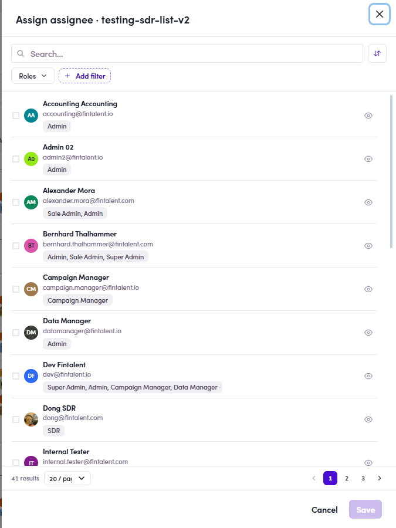

# O5.4 · Tick the assignee

> O5 · Assign a list to an SDR

The **Assign assignee** drawer opens: every user with a **Roles** filter (Admin, Sale Admin and SDR …). Search / filter and **tick the assignee**, usually the **SDR** (e.g. Dong SDR).

*O5.4: Assign assignee: user list + Roles filter → tick the person.*
