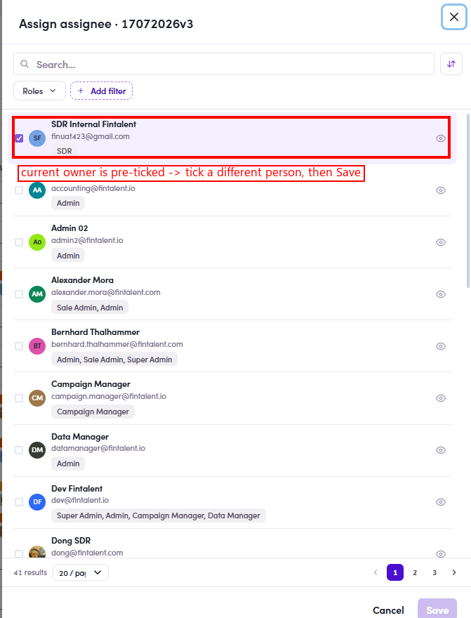

# O5.x.1 · Edit / re-assign

> O5 · Assign a list to an SDR → O5.x · Edge cases

**Edit / re-assign the owner.** Open the **Assign assignee** icon on the row again → pick a different person → **Save**. This **replaces** the current assignee (the list moves from the old owner's Segments into the new one's).

*O5.x.1 — re-assigning 17072026v3: the current owner (SDR Internal Fintalent) is pre-ticked → tick a different person → Save.*
