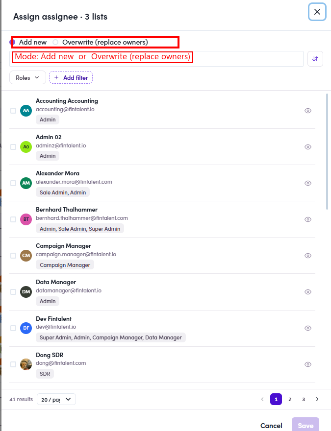

# O5.x.2 · Bulk assign

> O5 · Assign a list to an SDR → O5.x · Edge cases

**Bulk-assign several lists at once.** **Step by step:** ① in **Segments (Lists)** **tick the checkbox** of each list. ② In the action bar click **Assign assignee (N)**. ③ Pick the **mode**: **Add new** (adds this owner alongside existing ones) or **Overwrite (replace owners)** (clears existing owners first). ④ Tick the assignee → **Save**.

*O5.x.2: bulk Assign assignee across N lists, with Add new / Overwrite (replace owners) mode.*
