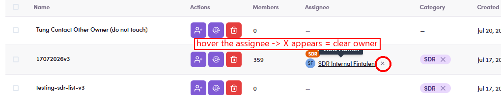

# O5.x.3 · Clear the owner

> O5 · Assign a list to an SDR → O5.x · Edge cases

**Clear the owner.** Fastest way: **hover the assignee** on the row → a **✕** appears right after their name → click it to remove the owner → the **Assignee** column shows **—** again and the list is held by nobody. (You can also open the Assign drawer and clear the selection.)

*O5.x.3 — hover the assignee → the ✕ (circled) appears; click it to clear the owner in one click.*
